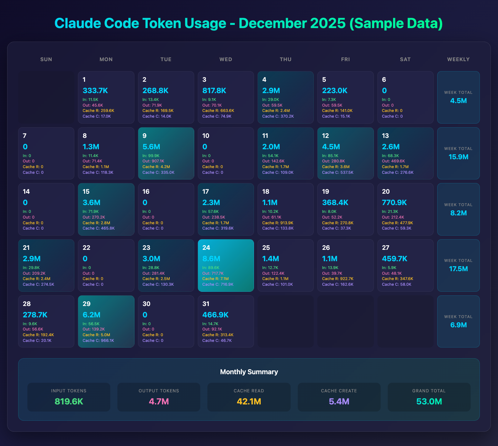

# Claude Code Usage Calendar

A standalone Python tool that generates beautiful HTML calendar visualizations of your [Claude Code](https://claude.ai/claude-code) token usage.



## Features

- **Zero dependencies** - Uses only Python standard library
- **Automatic file discovery** - Scans `~/` for Claude Code session files
- **Deduplication** - Handles streaming updates by taking MAX values per message
- **Timezone support** - Arizona time (UTC-7) by default, with UTC and custom offset options
- **Beautiful dark theme** - Modern gradient styling with hover effects
- **Comprehensive metrics** - Input, output, cache read, and cache creation tokens
- **Weekly & monthly totals** - Aggregated summaries at a glance

## Requirements

- Python 3.6+
- macOS (uses `open` command to launch browser)

No external packages required.

## Installation

```bash
# Clone the repo
git clone https://github.com/rickgorman/claude-usage-calendar.git
cd claude-usage-calendar

# Make executable
chmod +x claude-usage-calendar.py

# Run it
./claude-usage-calendar.py
```

Or just download the single file:

```bash
curl -O https://raw.githubusercontent.com/rickgorman/claude-usage-calendar/main/claude-usage-calendar.py
chmod +x claude-usage-calendar.py
./claude-usage-calendar.py
```

## Usage

```bash
# Default: December 2025, Arizona time
./claude-usage-calendar.py

# Different month/year
./claude-usage-calendar.py --month 11 --year 2025

# Use UTC timezone
./claude-usage-calendar.py --utc

# Custom timezone offset (e.g., PST = UTC-8)
./claude-usage-calendar.py --tz-offset -8

# Custom output path
./claude-usage-calendar.py -o ~/reports/usage.html

# Generate without opening browser
./claude-usage-calendar.py --no-open

# Quiet mode (no console output)
./claude-usage-calendar.py -q

# Search specific directory
./claude-usage-calendar.py --search-path ~/work/
```

## How It Works

1. **Scans** `~/` for Claude Code session files (`*.jsonl` with UUID/agent patterns)
2. **Parses** token usage from each message (input, output, cache read, cache create)
3. **Deduplicates** by message ID, taking MAX values (handles streaming updates)
4. **Aggregates** by date in the specified timezone
5. **Generates** a styled HTML calendar with daily/weekly/monthly breakdowns
6. **Opens** the result in your default browser

## Token Types

| Type | Description |
|------|-------------|
| **Input** | Tokens sent to the model (your prompts + context) |
| **Output** | Tokens generated by the model (responses) |
| **Cache Read** | Tokens read from prompt cache (saves cost) |
| **Cache Create** | Tokens written to prompt cache |

## Calendar Features

- **Color intensity** reflects relative daily usage (darker = low, bright cyan = high)
- **Hover effects** on day cells for visual feedback
- **Weekly totals** in the rightmost column
- **Monthly summary** with breakdown by token type
- **Animated gradient** title

## Options

```
--month, -m       Month (1-12), default: 12
--year, -y        Year, default: 2025
--utc             Use UTC instead of Arizona time
--tz-offset       Custom timezone offset from UTC (e.g., -8 for PST)
--output, -o      Output HTML file path (default: /tmp/claude_usage_calendar.html)
--no-open         Don't open the HTML file in browser
--search-path     Path to search for JSONL files (default: ~/)
--quiet, -q       Suppress console output
```

## Notes

- Arizona time (UTC-7) is the default since Arizona doesn't observe DST
- The tool only reads `.jsonl` files matching UUID or `agent-*` patterns
- Session files are typically stored in `~/.claude/projects/`

## License

MIT
