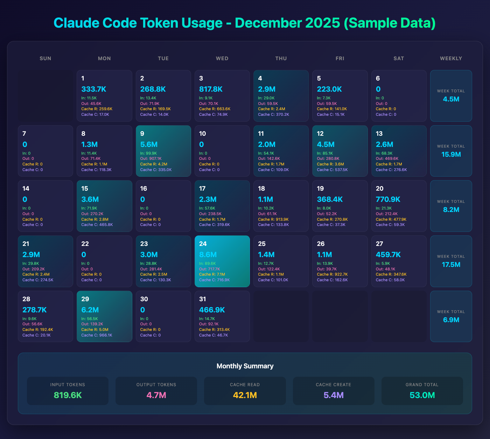

# AI Agent Usage Calendar

This standalone Python tool reads Claude, Codex, Grok, and Cursor Composer
session files and produces a token-usage JSON report or a self-contained HTML
calendar. Cost estimates are optional and are kept separate from the legacy
token report.



## Requirements

- Python 3.8+
- macOS for the optional `open` browser launch

The application uses only the Python standard library. No network request is
made while scanning sessions, loading a pricing pack, estimating costs, or
rendering the dashboard.

## Usage

```bash
./claude-usage-calendar.py                 # HTML; costs disabled
./claude-usage-calendar.py --json -q       # machine-readable legacy JSON
./claude-usage-calendar.py --costs --json -q
./claude-usage-calendar.py --no-costs --json -q
./claude-usage-calendar.py --pricing ./my-pack.json --json -q
./claude-usage-calendar.py --require-complete-pricing --json -q
./claude-usage-calendar.py --explain-costs --json -q
./claude-usage-calendar.py --no-open -o ~/reports/usage.html
```

`--costs`, `--pricing`, `--require-complete-pricing`, and `--explain-costs`
enable valuation. `--pricing PATH` selects one strict replacement pack; it does
not merge with the built-in pack. `--require-complete-pricing` exits with code
2 and emits no JSON when any visible usage is unpriced. `--explain-costs`
prints the bounded serialized cost explanation to stderr; JSON remains on
stdout. `--no-costs` is an explicit no-op and cannot be combined with an option
that implies costs. Costs are disabled by default, including in `--json -q`.

See [docs/cost-estimates.md](docs/cost-estimates.md) for the cost contract,
schema, provider assumptions, and reproducible validation commands. The
built-in snapshot and its source inventory are described in
[docs/pricing.md](docs/pricing.md).

## Agent sources and measurement quality

| Agent | Default location | Accounting |
| --- | --- | --- |
| Claude | `~/.claude/projects/**/*.jsonl` | Provider-recorded message usage; streaming snapshots are deduplicated. |
| Codex | `~/.codex/sessions/**/rollout-*.jsonl` | Provider-recorded `token_count` usage. |
| Grok | `~/.grok/sessions/**/updates.jsonl` | Recorded usage, deduplicated by session and prompt. |
| Composer | `~/.cursor/projects/**/agent-transcripts/**/*.jsonl` | Local transcript text is estimated at roughly four characters per token when counters are absent. |

Composer/Cursor quality is assigned per record: native cloud/team counters may
be `provider_reported`, while local transcript reconstruction is `estimated`.
A product-wide “Composer is always estimated” claim would hide this
distinction. The legacy JSON `agents[agent].estimated` flag remains a
compatibility summary for Composer files.

## Legacy token output

The existing `totals`, `daily_usage`, `hourly_usage`, and per-agent fields are
unchanged when costs are disabled. Token fields are input, output, cache-read,
and cache-creation counters. The HTML calendar has daily, monthly, yearly, and
all-time views, provider/token breakdowns, keyboard navigation, and local
timezone support (`--utc` and `--tz-offset` are available).

## Cost output at a glance

Enabled JSON appends a versioned `cost_estimates` object. Money is USD decimal
text rounded to six places; it is never a JSON number. Its required root fields
are `schema_version`, `basis`, `currency`, `valuation_as_of`, `pricing_pack`,
`status`, `quality`, `total_usd`, `priced_subtotal_usd`, `hourly_usage`,
`daily_usage`, `monthly_usage`, `yearly_usage`, `agents`, `components`,
`unpriced_components`, `diagnostics`, `assumptions`, and `disclaimer`.

`status` and `quality` answer different questions:

- `complete`: all visible usage has an exact rate; `total_usd` is available.
- `partial`: priced and unpriced usage coexist; `total_usd` is `null` and
  `priced_subtotal_usd` is only a known lower bound.
- `unpriced`: visible usage has no priced component; total is `null` and the
  subtotal is `"0.000000"`.
- `disabled`: an internal dashboard state only; the cost section is omitted
  from machine JSON when costs are off.

Quality is `provider_reported`, `derived`, `estimated`, or rollup-only `mixed`.
Every component has one of the first three qualities. A cost is a
published-rate-equivalent snapshot revaluation as of the selected pack’s
`valuation_as_of` date—not historical spend, an invoice, or a statement about
discounts, credits, taxes, or contract terms.

The generated dashboard is a static local artifact. It contains its data and
does not start a server or make third-party requests. Anyone who receives the
HTML can read its embedded session data; the file is not a confidentiality
boundary. The cost fragment has no executable or remote/resource sinks and
escapes untrusted displayed text. If an external service later serves the
artifact, it must be separately reviewed and apply the serving-layer policy in
`costs.dashboard.REQUIRED_SERVED_DASHBOARD_HEADERS`; that policy is not applied
by the current file writer.

## License

MIT
